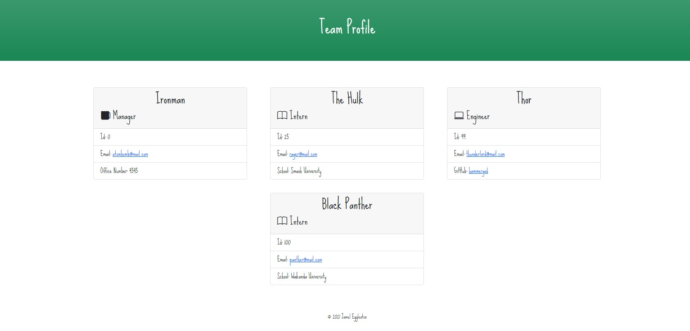

# Team Profile Generator

As a member of a team, sometimes you need to keep track of who's on your team. This application allows you to log some basic information about them. This way you can never forget who's on your team!

## Table of Contents
* [Installation](#Installation)
* [Usage](#Usage)
* [Test](Test)
* [Questions](#Questions)

## Installation
><b>Required to run this application:</b>
* Node
* Inquirer (Node Package)
* FS (Node Package)

## Usgae
Before you can invoke this application use the command below. This will install all required dependencies.</b>

```bash
npm i
```
To invoke this application use the command below:</b>
```bash
node index.js
```
After you run the command above, the user will be prompted to answer a series of questions within the terminal window about the team members. Once you create you first team member, you will give the option to add additional members to your team. Once completed the application will then take the user's inputs and insert them into the a newly generated HTML file that can be viewed in the browser.</b>

*Please note that you cannot create a team member until the manager is created first. 

## Test
screen shot below:</b>


example of how application works:</b>

https://user-images.githubusercontent.com/74510050/139378493-d7f9385a-8b4e-4fa0-aa40-1da456f6f42a.mp4


## Questions
Do you have questions? Contact me here:
* [Github](https://github.com/jameleggleston)
* [Email](jamel.eggleston@gmail.com)


[Back to top](#Team-Profile-Generator)
